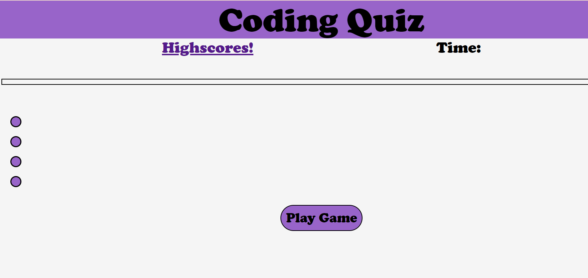

# coding-quiz-challenge

# first I put all of my questions, answers, and correct answers in an array together

# this is the first thing you will see when opening the quiz page

# once you hit the "Play Game" button, a question will show up in the text box, the 4 purple buttons will populate with answers, and the timer will begin. Each answer you choose will either grant you one point if it is correct or no points and a penalty of losing 5 seconds from the timer. Either way, you will also be brought to the next question. There are 4 questions in total.

# At the end of the quiz, a confirm popup window will show you your score and ask if you would like to record it. If you hit "cancel," then the page will reload, allowing you to try again. If you hit "confirm," you will redirected to the score page.

# Here you can enter your name and hit the "submit" button. Once you have done this, both your name and score will be added to the scoreboard.